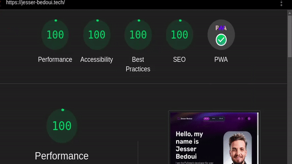

# Portfolio Web Page
This is a portfolio web page built using the Astro framework.

Awesome links used in this project: 
- backdrop cursor effect: https://www.youtube.com/watch?v=kySGqoU7X-s


## Table of Contents
- Installation
- Usage
- Credits
- License

## How This Site Rocks

the website is a blazingly fast ⚡⚡, scoring perfect 100s in Google Lighthouse. This means it's fast, easy to use, and looks great on any device. Check out the GIF below to see for yourself:
<br>

## Packages

- `@astrojs/prefetch`: provides a component for prefetching assets that are needed for upcoming routes in an Astro project.
- `@astrojs/sitemap`: generates a sitemap for your Astro website, which is a file that helps search engines index your website's pages.
- `astro`: The main Astro package, which is a framework for building static websites using modern web standards like Web Components and React.
- `astro-compress`: provides a plugin for Astro that compresses the output HTML, CSS, and JavaScript files to improve website performance.
- `astro-seo`: provides a plugin for Astro that generates meta tags for SEO optimization, such as title and description tags for each page.
- `@vite-pwa/astro`: provides a plugin for Astro that adds PWA (Progressive Web App) support, which enables users to install your website as an app on their device.
- `vite-plugin-pwa`: provides a plugin for Vite (the build tool used by Astro) that generates a service worker and manifest file for your website, which are needed for PWA support.
## Installation

To install this project, you will need to have the following dependencies installed on your machine:

- Node.js : `16`
- npm

Once you have those dependencies installed, you can clone this repository by running the following command:

```sh
git clone https://github.com/bedouijesser/porftolio.git
```
Then, navigate to the project directory and install the project dependencies by running:

```sh
npm install
```
## Usage
To start the local development server, run:

```sh
npm start
```
This will start the development server on http://localhost:3000/.

To build the production version of the website, run:

```sh
npm run build
```
This will create a public directory with the compiled website.

## Credits
This website was created by Jesser Bedoui. The design is based on the [Astro Portfolio Template](https://github.com/withastro/astro/tree/main/examples/portfolio).

## License
This project is licensed under the terms of the MIT license. See the [LICENSE](./LICENSE.md) file for details.